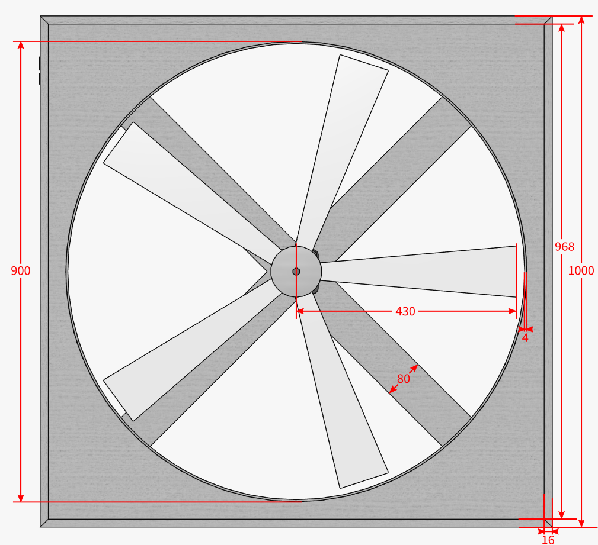

# DMX-Ventilator

## Motivation

Wir waren im Dezember 2015 auf dem [Contact Indoor Festival München](https://www.facebook.com/events/544198745721461/ "Facebook-Versnataltung"). Was uns dort neben der Musik am meisten beeindruckt hat, waren die Ventilatoren, die als Effektgeräte hinter der Bühne im Zenith&nbsp;I heruntergelassen werden und sich drehen konnten. Die Flügel haben in einer einstellbaren Farbe geleuchtet und auch die Geschwindigkeit war in einem weiten Bereich regelbar.

Auf YouTube gibt es sie auch in Bewegung zu sehen:
https://www.youtube.com/watch?v=OpufAzwtyVI (rot in verschiedenen Geschwindigkeiten)
https://www.youtube.com/watch?v=SzctCUNd09I (blau)

So etwas wollten wir jetzt auch auch!

## Planung

### Elektronik

Bei der Suche nach DMX-Selbstbau-Projekten verweist letztendlich fast jede Quelle auf [Hendrik Hölschers Seiten](http://www.hoelscher-hi.de/hendrik/wahl.htm). Sein [DMX-LED-Dimmer](http://www.hoelscher-hi.de/hendrik/light/dmxled.htm) hat schon einige Features, die auch unser Ventilator haben soll: Über DMX können 8 Kanäle gesteuert werden (zusätzlich sogar gestrobed), dank AVR-Microcontroller ist die Schaltung einfach zu programmieren und zu verändern und die Hardware ist sehr modular gehalten, sodass auch andere Projekte einfach realisiert werden können.

Es fehlt jedoch die Ansteuerung eines Motors. Außerdem wollen wir LED-Strips verwenden, da sie einfach zu montieren sind, und die brauchen noch eine extra Stromversorgung. Also muss eine zweite Platine her, die die Ansteuerungen übernimmt. Sie ist so gelayoutet, dass auch ein Lochraster-Aufbau möglich ist.

Beide Schaltungen hängen dann zusammen an einer 12V-<abbr title="Gleichspannung">DC</abbr>-Stromversorgung und werden über die 8-polige Steckerleiste miteinander verbunden.

Zum Programmieren des Microcontrollers werden über den ISP-Port die nötigen Anschlüsse herausgeführt. Da es jedoch ein standardisiertes 10-Pin-ISP-Interface gibt, das auch die gängigen [Programmieradapter](http://www.mikrocontroller.net/articles/AVR_In_System_Programmer) verwenden, habe ich mir ein zusätzliches Adapterkabel gebaut.

**Downloads für [EAGLE](http://www.cadsoft.de/download-eagle/):** [avr-adapter.sch](eagle/avr-adapter.sch), [dmx-transciever.sch](eagle/dmx-transciever.sch), [motortreiber.brd](eagle/motortreiber.brd), [motortreiber.sch](eagle/motortreiber.sch)

### Gehäuse & Mechanik

Am Motor wird eine Edelstahlwelle befestigt, die von einem Kugellager drehbar in Position gehalten wird. Die Rotorblätter sollen aus milchigem Plexiglas geschnitten werden, da diese als Lichtleiter bei der Anstrahlung mit den LED-Strips hoffentlich eine gute Ausleuchtung erzielen. Sie werden zwischen zwei großen Beilagscheiben mit mehreren Schrauben / Nieten befestigt und als ganzes von vorne an die Achse geschraubt.

Mit [Autodesk 123D Design](http://www.123dapp.com/design) lässt sich recht schnell ein vorzeigbares 3D-Modell erstellen. Dabei kann man schon vor dem physischen Aufbau Mängel in der Konstruktion erkennen und beheben.

### Teile- und Bestellliste

| Stück | Bezeichnung                    | Link |
| -----:| ------------------------------ | ---- |
| 1 | 12V-DC-Getriebemotor 200rpm        | [eBay](http://www.ebay.de/itm/351368945189) |
| 1 | Neuer Motor                        | [Conrad](https://www.conrad.de/de/getriebemotor-12-v-modelcraft-rb350030-0a101r-130-227544.html) |
| 1 | RGB-LED-Strip 4m                   | [eBay](http://www.ebay.de/itm/151160889546) |
| 1 | 12V-DC-Netzteil 4A                 | [eBay](http://www.ebay.de/itm/151581215241) |
| 1 | Lochrasterplatine 4×6cm            | [eBay](http://www.ebay.de/itm/261846070281) |
| 1 | Transciever-Board                  | [embedded projects](http://shop.embedded-projects.net/sonstige/dmx-transceiver.html) |
| 1 | 3-Pol-XLR-Einbaubuchse (DMX-In)    | [Pollin](http://www.pollin.de/shop/dt/NTM2OTQ1OTk-/HiFi_Car_HiFi_Video_TV/Steckverbinder/Sonstiges/XLR_Einbaubuchse.html) |
| 1 | 3-Pol-XLR-Einbaustecker (DMX-Out)  | [Pollin](http://www.pollin.de/shop/dt/NDM2OTQ1OTk-/HiFi_Car_HiFi_Video_TV/Steckverbinder/Sonstiges/XLR_Einbaustecker.html) |
|   | mehradriges Kabel (z.B. IDE-Kabel) | |
| 1 | Edelstahlwelle 50mm, ø 20mm        | [eBay](http://www.ebay.de/itm/121103784726) |
| 1 | Flanschlager ø 20mm                | [eBay](http://www.ebay.de/itm/251852780407) |
|   | Acrylglas, 6mm                     | [eBay](http://www.ebay.de/itm/151269316675) |
|   | Aluminium-Platte, 4mm              | [eBay](http://www.ebay.de/itm/141345316955) |
|   | Holz (Multiplex), 16mm             | |
|   | MDF, 4mm                           | |
|   | Senkkopf-Holzschrauben             | |
| 6 | Rundkopf-Holzschrauben             | |
| 1 | Madenschraube M4                   | |
| 1 | Metallschraube M8, 35mm            | |
| 2 | Metallschraube M10, 30mm           | |
| 2 | Mutter M10                         | |
| 4 | Senkkopf-Metallschraube M2.5, 10mm | |
| 3 | Abstandshalter ca. 5mm             | |
| 3 | Abstandshalter ca. 12mm            | |

**Bestückung**

| Stück | Bezeichnung   | Teilenamen Transciever / Motortreiber | Link |
| -----:| ------------- | ------------------------------------- | ---- |
| 1 | 10-Pol-DIP-Switch | SW1 / –                | [eBay](http://www.ebay.de/itm/121855976441) |
| 1 | ATmega8515-P      | IC1 / –                | [eBay](http://www.ebay.de/itm/310716403642) |
| 1 | 75176AP           | IC2 / –                | [eBay](http://www.ebay.de/itm/381374573295) |
| 1 | 7805              | IC3 / –                | [Pollin](http://www.pollin.de/shop/dt/ODU5OTI4OTk-/Bauelemente_Bauteile/Aktive_Bauelemente/Spannungsregler/Spannungsregler_ST_L7805CV.html) |
| 1 | IC-Sockel 40-polig | für IC1 / –            | [Pollin](http://www.pollin.de/shop/dt/OTY5OTk1OTk-/Bauelemente_Bauteile/Mechanische_Bauelemente/IC_Fassungen_Adapterplatinen/IC_Fassung_40_polig.html) |
| 1 | IC-Sockel 8-polig | für IC2 / –            | [Pollin](http://www.pollin.de/shop/dt/Nzc5OTk1OTk-/Bauelemente_Bauteile/Mechanische_Bauelemente/IC_Fassungen_Adapterplatinen/IC_Praezisionsfassung_8_polig.html) |
| 3 | TLE-4202-B        | – / IC1, IC2, IC3      | [Pollin](http://www.pollin.de/shop/dt/NTU5ODk4OTk-/Bauelemente_Bauteile/Aktive_Bauelemente/IC/TLE4202B_STS_B57928.html) |
| 1 | Quartz 8MHz       | Q1 / –                 | [Pollin](http://www.pollin.de/shop/dt/MTk5OTY3OTk-/Bauelemente_Bauteile/Passive_Bauelemente/Quarze_Oszillatoren/Quarz.html) |
| 2 | Kondensator 27pF (**genau!**) | C1, C2 / – | [Conrad](https://www.conrad.de/de/keramik-scheibenkondensator-27-pf-100-vdc-5-x-h-35-mm-x-4-mm-1-st-457175.html) |
| 2 | Kondensator 100nF | C7 / C4                | [Pollin](http://www.pollin.de/shop/dt/OTA4OTk3OTk-/Bauelemente_Bauteile/Passive_Bauelemente/Kondensatoren/Folien_Kondensator_100_nF.html) |
| 5 | Kondensator 220nF | – / C1, C2, C3, C6, C7 | [Pollin](http://www.pollin.de/shop/dt/OTgzOTk3OTk-/Bauelemente_Bauteile/Passive_Bauelemente/Kondensatoren/MKT_Kondensator.html) |
| 3 | Elko 100µF        | C5, C6 / C5            | [Pollin](http://www.pollin.de/shop/dt/MTM2OTg3OTk-/Bauelemente_Bauteile/Passive_Bauelemente/Elkos_Goldcaps/Elko_100_F_25_V_10_Stueck_NIPPON_CHEMI_CON_KZE.html) |
| 1 | LED rot 3mm       | LED1 / –               | [Pollin](http://www.pollin.de/shop/dt/MjY5OTc4OTk-/Bauelemente_Bauteile/Aktive_Bauelemente/LEDs/LED.html) |
| 1 | LED grün 3mm      | LED2 / –               | [Pollin](http://www.pollin.de/shop/dt/OTA5ODc4OTk-/Bauelemente_Bauteile/Aktive_Bauelemente/LEDs/LED_KINGBRIGHT_L_934SGDLK_gruen_3_mm_10_Stueck.html) |
| 1 | Poti 10kΩ         | R1 / –                 | [Pollin](http://www.pollin.de/shop/dt/MTM3OTU3OTk-/Bauelemente_Bauteile/Passive_Bauelemente/Potis_Trimmer_Encoder/Potentiometer_PIHER_PT_10.html) |
| 2 | Widerstand 1Ω (4,7Ω geht auch) | – / R1, R2 | [Pollin](http://www.pollin.de/shop/dt/MTQyOTc3OTk-/Bauelemente_Bauteile/Passive_Bauelemente/Widerstaende/Metallfilm_Widerstaende.html) |
| 3 | Widerstand 390Ω (470Ω geht auch) | R2, R3, R4 / – | [Pollin](http://www.pollin.de/shop/dt/ODIyOTc3OTk-/Bauelemente_Bauteile/Passive_Bauelemente/Widerstaende/Metallfilm_Widerstaende.html) |
| 1 | Stiftleiste 1×2   | JP4 / –                | [Pollin](http://www.pollin.de/shop/dt/OTQ0ODQ1OTk-/Bauelemente_Bauteile/Mechanische_Bauelemente/Steckverbinder_Klemmen/Stiftleiste_vergoldet_1x_20_polig_10_Stueck.html) (rowspan=5) |
| 2 | Stiftleiste 1×3   | JP2, JP3 / –           | |
| 1 | Stiftleiste 1×4   | – / JP2                | |
| 1 | Stiftleiste 1×5   | JP1 / –                | |
| 2 | Stiftleiste 1×8   | JP6 / JP1              | |
| 1 | Stiftleiste 2×3   | JP5 / –                | [Pollin](http://www.pollin.de/shop/dt/NDkyOTQ1OTk-/Bauelemente_Bauteile/Mechanische_Bauelemente/Steckverbinder_Klemmen/Stiftleiste.html) |
| 1 | Stiftbuchse 1×3   |                        | [Conrad](https://www.conrad.de/de/buchsenleiste-praezision-anzahl-reihen-1-polzahl-je-reihe-36-w-p-products-153-036-1-50-10-1-st-736427.html) (rowspan=4) |
| 1 | Stiftbuchse 1×4   |                        | |
| 1 | Stiftbuchse 1×2   |                        | |
| 2 | Stiftbuchse 1×8   |                        | |

## Aufbau der Elektronik

## TODO: Verbindungskabel falsch rum

## Programmieren

Der folgende Abschnitt bezieht sich auf das Programmieren unter Ubuntu Linux. Bei anderen Betriebssystemen müssen entsprechend andere Programme zum Assemblieren und Übertragen des Codes verwendet werden.

Als Programmier-Interface verwende ich [USBasp](http://www.fischl.de/usbasp/), das es als fertige Platine oder als Bausatz zum Selberlöten gibt. Nach Anschluss des Programmieradapters (siehe Foto oben) kann mit dem folgenden Befehl das Testfile von Hendrik Hölschers Webseite ([board.hex](http://www.hoelscher-hi.de/hendrik/light/ressources/board.hex)) übertragen werden:

    sudo avrdude -p atmega8515 -c usbasp -B 3 -U flash:w:board.hex

* `sudo`: ohne Root-Rechte bekomme ich eine Fehlermeldung (*access denied*)
* `-p atmega8515`: Angabe des verwendeten Microcontrollers
* `-c usbasp`: Angabe des Programmier-Interfaces
* `-B 3`: kleinster Wert für die `bit clock period`, damit USBasp erkannt wird
* `-U flash:w:board.hex`: schreibe das Testfile in den Flash-Speicher

**Testfunktionen:**

| DIP-Switch    | Bedeutung |
| ------------- | --------- |
| Alle DIPs off | Blinken der roten LED zeigt an, dass das Testfile in den Flash geladen wurde. |
| Alle DIPs an  | Leuchten der grünen LED zeigt an, dass alle DIP-Schalter korrekt verlötet sind. |
| DIP1 an       | Leuchten der grünen LED zeigt an, dass die fuse bits angepasst wurden. |
| DIP2 an       | Leuchtet die grüne LED, liegt ein korrektes DMX-Signal an. Ein Blinken indiziert, dass D+ und D- verpolt sind. |
| DIP3 an       | Leuchtet die grüne LED, funktioniert die angeschlossene ZC-Detection. (für uns irrelevant) |

Mit dem Testprogramm habe ich festgestellt, dass alles passt, aber die Fuse bits noch nicht gesetzt wurden. Zuerst wollen wir die aktuell gesetzten Bits lesen: `sudo avrdude -p atmega8515 -c usbasp -B 3 -n` liefert `Fuses OK (E:FF, H:D9, L:E1)`. Durch Herumspielen mit dem [AVR Fuse Calculator](http://www.engbedded.com/fusecalc), bis die Werte mit denen in http://www.hoelscher-hi.de/hendrik/light/ressources/an011.pdf übereinstimmen, bin ich auf den folgenden Befehl gekommen:

    sudo avrdude -p atmega8515 -c usbasp -B 3 -U lfuse:w:0x3f:m -U hfuse:w:0x9d:m

Danach lief das Testprogramm problemlos durch.

### `udev`-Regel

Um `avrdude` nicht jedes Mal mit Root-Rechten ausführen zu müssen, fügt man eine neue *udev rule* hinzu. Dazu erstellt man die Datei `/etc/udev/rules.d/60-usbasp.rules` mit dem folgenden Inhalt:

    # USBasp
    SUBSYSTEM=="usb", ATTRS{idVendor}=="16c0", ATTRS{idProduct}=="05dc", GROUP="adm", MODE="0666"

Danach wird die neue Datei mit `sudo service udev restart` eingelesen und man kann künftig `avrdude` ohne Root-Rechte zum Übertragen verwenden.

### Assembler und Makefile

Danach geht es an den eigentlichen Projekt-Code (`LED.asm` inkl. `lib_asm.asm`).

Als Assembler (der `.asm`-Dateien in übertragbare `.hex`-Dateien assembliert) verwenden wir `avra`.

Damit wir zum Assemblieren und Übertragen nicht immer zwei einzelne Befehle ausführen müssen, erstellen wir uns ein **Makefile**:

    file = LED.hex

    all: $(file)
        avrdude -p atmega8515 -c usbasp -B 3 -U flash:w:$(file)

    %.hex: %.asm
        avra -I "/usr/share/avra" $*.asm

    fuse:
        avrdude -p atmega8515 -c usbasp -B 3 -U lfuse:w:0x3f:m -U hfuse:w:0x9d:m

    test:
        avrdude -p atmega8515 -c usbasp -B 3 -U flash:w:board.hex

**Achtung:** Die Einrückung muss hier mit Tabs geschehen!

In `/usr/share/avra` liegen die Microcontroller-Definitionsdateien, also insbesondere auch `m8515def.inc`, das wir für unser Projekt brauchen. Mit der Option `-I` weisen wir `avra` an, auch in diesem Verzeichnis nach den Include-Dateien zu suchen.

Beim ersten Ausführen mit `make` gab es Fehlermeldungen, dass `avra` diese Kommentare nicht kennt: `/* … */` und `// …`. Daher habe ich sie durch `; …` ersetzt. Danach konnte ich bereits ohne Probleme assemblieren und übertragen und das Programm funktioniert tadellos.

Danach habe ich die beiden Dateien zusammengeführt, um leichter zu verstehen, was wo passiert.

Jetzt kann es an die eigenen Erweiterungen gehen!

### DIP-Switch

Die DIP-Schalter-Stellungen sollen unverändert weiterhin gelten:
**DIP1 - DIP9** stellen die DMX-Adresse dar (Bit 0 - 8 in aufsteigender Reihenfolge)
**DIP10** aktiviert den Standalone Mode, womit folgendes gilt:

| DIP-Switch | Funktion        |
| ----------:| --------------- |
|      1 - 3 | Programm        |
|      5 - 8 | Geschwindigkeit |
|          9 | Strobe          |

Die auswählbaren Programme müssen aber entsprechend angepasst bzw. durch neue ersetzt werden, damit diese die verschiedenen LED-Farben und den Motor entsprechend ansteuern. Zum Testen reichen aber erst mal die vorgegebenen.

### Standalone-Programme

Ich habe den IC2 (75176B), welcher für die Übersetzung von DMX in das vom Microcontroller verständliche USART zuständig ist, in China bestellt. Da dieser wegen der langen Lieferzeit noch nicht da ist, mache ich mich zuerst an die Standalone-Programme. Diese werden durch den [DIP-Switch](#dip-switch) bestimmt und können daher ohne anliegendes DMX-Signal getestet werden.

Ein vorgegebenes Programm (DIP2 an) sieht z.B. so aus:

    .org PAT1                   ; Lauflicht
    .dw 0b0000000001
    .dw 0b0000000010
    .dw 0b0000000100
    .dw 0b0000001000
    .dw 0b0000010000
    .dw 0b0000100000
    .dw 0b0001000000
    .dw 0b0010000000
    .dw 0b1100000000

Dabei stehen die einzelnen Zeilen für die unterschiedlichen Zustände, die ineinander übergefaded werden sollen. Das erste Bit ist nur beim letzten Zustand gesetzt, um das Ende des Programms zu kennzeichnen. Danach folgen die Werte für die Ausgänge `A` (ungenutzt), `M+`, `M-`, `R`, `G`, `B`, `P` (ungenutzt, aber aufs zweite Board herausgeführt) sowie zwei weitere nicht benutzte Ausgänge.

Der Motor dreht sich im Uhrzeigersinn, wenn `M+` und `M-` auf `0` und `1` gesetzt werden bzw. gegen den Uhrzeigersinn für `1` und `0`. Liegt an beiden Ausgängen der selbe Pegel an, dreht der Motor sich nicht.

Die LEDs sind an, wenn der entsprechende Ausgang auf *low* gesetzt wird.

Das folgende Beispiel zeigt also einen RGB-Fader, bei dem der Motor immer im Uhrzeigersinn dreht:

<pre>
.dw 0b0001011000
.dw 0b0001001000
.dw 0b0001101000
.dw 0b0001100000
.dw 0b0001110000
.dw 0b<strong>1</strong>001010000
</pre>

Die anderen Programme könnt ihr im Code selbst anschauen.

### DMX-Channels

Die DMX-Channels sollen wie folgt aussehen:

| DMX-Channel | Funktion                              |
| -----------:| ------------------------------------------------------------------------ |
|           0 | 
Motor
<table><tbody><tr><td align="right">0 - 3</td><td>aus</td></tr><tr><td align="right">4 - 119</td><td>gegen den Uhrzeigersinn (immer langsamer)</td></tr><tr><td align="right">120 - 139</td><td>aus (Mitte)</td></tr><tr><td align="right">140 - 255</td><td>im Uhrzeigersinn (immer schneller)</td></tr></tbody></table> |
|           1 | rote LEDs                             |
|           2 | grüne LEDs                            |
|           3 | blaue LEDs                            |
|           4 | LED-Strobe (optional)                 |
|           5 | Master-Helligkeit für LEDs (optional) |

Mehr Channels brauchen wir nicht.

Um die Farb-Channels schon einmal richtig zu mappen, habe ich im Label `pwm_exit` den Abschnitt angepasst, der die Werte vom `DMX_FIELD` auf das `PWM_FIELD` kopiert, von wo aus sie im nächsten Timer-Durchlauf ausgegeben werden.

Der Motor erfordert etwas mehr Aufwand, da von einem Channel aus zwei Ausgänge gesteuert werden sollen. Ich habe mir die Funktion `eval_strobe_freq` zum Vorbild genommen und auch von der main loop aus die neue Funktion `eval_motor_speed` aufgerufen. Diese springt je nach DMX-Wert in verschiedene Sublabels. Von dort aus wird der DMX-Wert auf einen Bereich von 0 bis 115 gebracht und mit diesem Wert aus `MOTOR_MAP` der jeweils auszugebene PWM-Wert (0 bis 255) geholt und ins `PWM_FIELD` geschrieben. Das ist nötig, da wir leider nicht einfach mit einer Fließkommazahl multiplizieren können (etwa `y = x * 255/115;`).

Die Strobe-Funktion war ja schon eingebaut und musste nur so angepasst werden, dass sie auf DMX-Kanal 4 statt 1 hört (einfach) und nur die LEDs und nicht den Motor flasht. Dazu habe ich im Label `pwm` den Code so geändert, dass alle Kanäle immer normal auf den jeweiligen Wert, und danach beim Blackout mit Hilfe eines logischen Oders nur die LED-Kanäle auf 1 gesetzt werden.

#### Motor-Bremse

Da der Motor nicht allzu schnell von einem Wert auf einen anderen beschleunigen bzw. abbremsen sollte, habe ich die Funktion `eval_motor_speed` danach so abgeändert, dass in jedem Durchlauf der Soll-Wert (`DMX_FIELD` und `MOTOR_MAP`) und der Ist-Wert (`PWM_FIELD`) verglichen werden und der Output nur um eins inkrementiert oder dekrementiert wird.

Da das aber viel zu schnell abläuft, vergleiche ich vorher zusätzlich, dass die beiden Register `checkMotorL` und `checkMotorH` gleich null sind. Dieses Quasi-16-bit-Register wird vom Interrupt-Handler `pwm`, der bei jedem Overflow von `Timer0` aufgerufen wird, je um eins inkrementiert. Das war dann aber wiederum viel zu langsam, sodass `checkMotorH` sofort wieder auf null zurückgesetzt wird, sobald es den Wert 20 erreicht hat. Die Geschwindigkeit sieht im Testbetrieb vernünftig aus, eventuell muss an dem Wert aber noch gefeilt werden, sobald der Motor eingebaut ist.

Leider hat es unseren ersten Motor mit dem Wert von 20 zerschossen. Wir haben danach einen leistungsfähigeren besorgt, trotzdem wollten wir auf Nummer sicher gehen und haben den Wert auf 40 verdoppelt. Da dann aber das Anfahren sehr, sehr langsam ist, erlauben wir ein Inkrementieren öfter als ein Dekrementieren.

### Hilfe bei Assembler-Kommandos

Da man häufig mal nachschauen muss, was die einzelnen Assembler-Kommandos bedeuten, habe ich hier eine kleine Hilfe programmiert: Einfach Befehl oder Direktive eingeben (z.B. `jmp` oder `.equ`) und es werden Einzelheiten angezeigt.

<input type="text" id="asm-help-input" placeholder="Assembler-Hilfe" />

## Mechanischer Aufbau

*(readme is not complete; see rest of the repository for more information)*